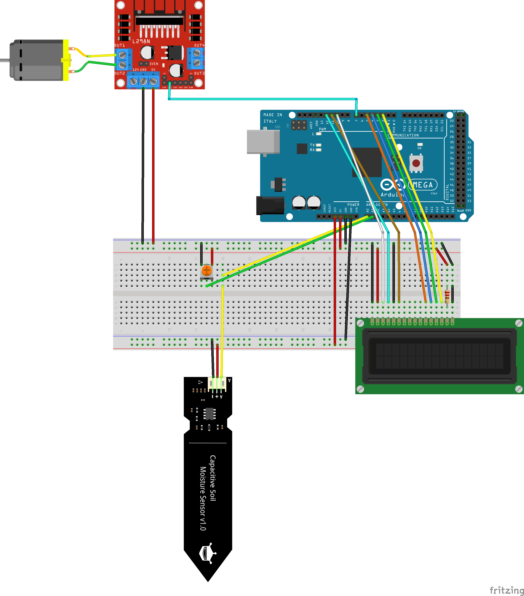

# plant-watering-system V1
### Parts
- Arduino due
- Bread Board
- 12v 5A Power Supply
- L298N Motor Driver
  - 
- Gikfun 12V DC Peristaltic Dosing Pump
  - 
- LCD Display
- Potentiometer
- Capacitive Soil Moisture Sensor Module V1.2
  - 
- Tubing
- Tube Fittings

### Description
This is a system is designed to hold constant soil moisture for a plant. 

### Schematic

### Pictures
//TODO
